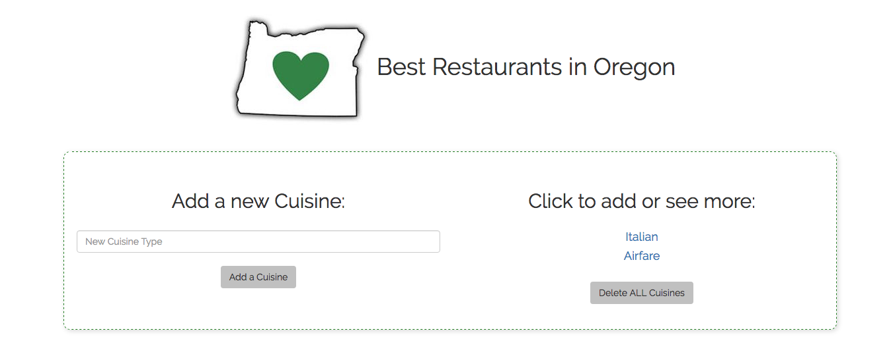

# Best Restaurants

#### _A best restaurant website using MySQL, September 21, 2016_

#### By _**Katy Henning & Aimen Khakwani**_

## Description

This is a dynamic site that takes user input and generates lists of restaurants and organizes them based on their cuisine using MySQL. Add a cuisine, then a list of restaurants that correspond.

## Setup/Installation Requirements

* Clone the repository
* Using the command line, navigate to the project's root directory
* Install dependencies by running $ composer install
* Start MySQL by running the command $ /Applications/MAMP/Library/bin/mysql --host=localhost -uroot -proot
* Start Apache by running the command $ apachectl start
* Import the MySQL file from localhost:8080/phpmyadmin/
* Navigate to the /web directory and start a local server with $ php -S localhost:8000
* Open a browser and go to the address http://localhost:8000 to view the application

## Known Bugs

There are no known bugs at this time.

## Support and Contact Details

For questions or comments, please contact us through GitHub.

## Technologies Used

* _PHP_
* _Silex_
* _Twig_
* _Bootstrap_
* _MySQL_

### License

*This website is licensed under the MIT license.*  
Copyright (c) 2016 **_Katy Henning & Aimen Khakwani_**
